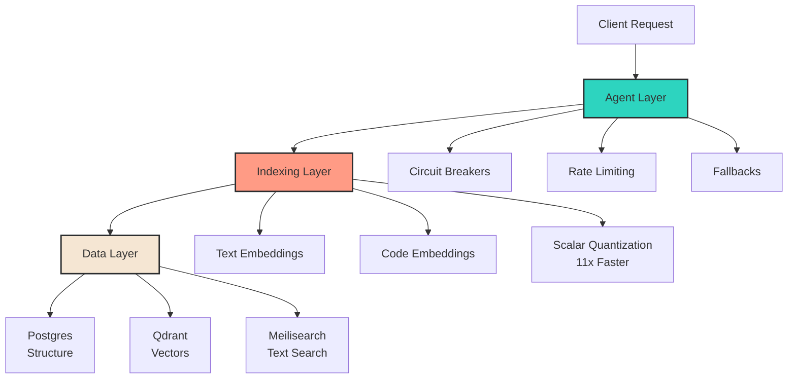
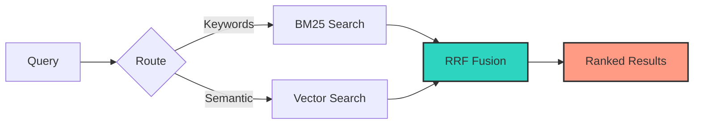
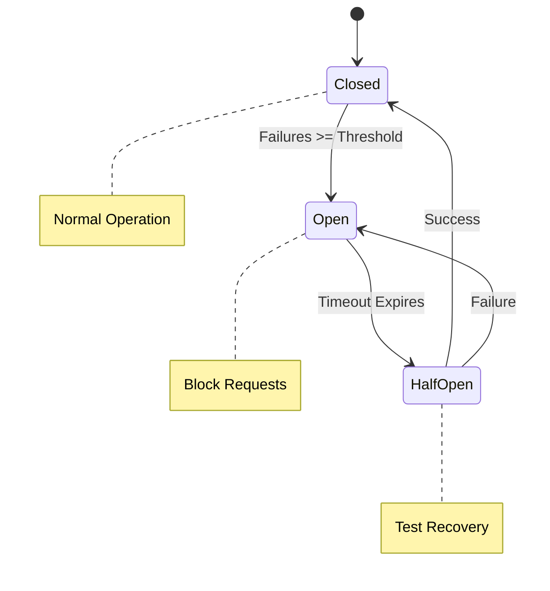

# Building Production-Ready AI Agents

The gap between demo and production is where most AI projects die.

## The Reality

Prototypes work on your laptop. Production handles 1M+ requests per day. The problems change completely. Scale shifts from 1 user to 100k concurrent. Cost jumps from $10 to $10k/day. Latency drops from 5 seconds to 100ms. Reliability climbs from 60% to 99.9%.

Different world. Different rules.

## Architecture

Most production AI systems follow a three-layer pattern. Not because it's trendy. Because it works.



The agent layer handles requests and failures. Circuit breakers, rate limiting, fallback strategies. The indexing layer transforms content into searchable formats. Dual embeddings for text and code. Scalar quantization makes it 11x faster. The data layer stores everything. Postgres for structure. Qdrant for vectors. Meilisearch for text.

Each layer has one job. Do it well.

## Search at Scale

Pure vector search isn't enough. I've tried. It fails on exact matches, domain terminology, and proper nouns.

Hybrid search wins. Combine BM25 for keywords with vector search for semantics. Fuse results with Reciprocal Rank Fusion.



The stack that works: Qdrant for vectors, sentence-transformers for text, jina-embeddings for code. Sub-100ms p95 latency at scale.

## Cost Optimization

Most teams waste 80% of their LLM budget. I've seen it repeatedly.

Cache aggressively. Both semantic and exact matches. Use the right model for each task—GPT-4 for complex reasoning, 3.5-turbo for simple operations. Batch non-urgent requests. Monitor token usage like you monitor costs.

One client went from $15k/month to $3k with better caching. Same quality. 80% less spend.

## Observability

You can't fix what you can't see. Essential metrics: latency at p50, p95, p99. Token usage per request. Cost per operation. Error rates by type.

Tools that scale: Langfuse for 1M+ ingestions/day. Phoenix for evaluation-heavy workloads. LangSmith for LangChain apps.

Set alerts early. Cost spikes happen fast.

## Evaluation

Accuracy isn't enough in production. Measure task completion rate. Track hallucination frequency. Monitor user satisfaction. Calculate cost per successful interaction.

Build evals before you ship. Not after.

## Production Patterns

### Circuit Breakers

Think of circuit breakers as automatic failure protection. Three states: closed (normal operation), open (blocking requests), half-open (testing recovery).



When failures exceed your threshold, flip to open. Block requests until timeout. Test with half-open. Success means back to normal. Failure means stay blocked.

Simple implementation:

```python
class CircuitBreaker:
    failure_threshold = 5
    state = "closed"

    def call(self, func):
        if self.state == "open":
            return fallback()
        try:
            return func()
        except:
            self.fail_count += 1
            if self.fail_count >= self.failure_threshold:
                self.state = "open"
```

### Context Management

Compress old messages. Keep the last 5 full. Truncate to token limits. Don't lose critical context.

### Retry Logic

Exponential backoff. Max 3 retries. Different strategies per error type. Log failures for analysis.

## What Actually Matters

Infrastructure beats prompts. Good prompts on bad infrastructure equal production fires. Average prompts on solid infrastructure equal reliable systems.

Focus order: observability first, cost tracking second, error handling third, scaling patterns fourth, prompt engineering last.

## Common Mistakes

No rate limiting. You'll learn this the expensive way. Treating LLMs as deterministic—they're not. Ignoring tail latencies—p99 matters more than average. No fallback strategy—things will fail. Manual cost tracking—automate or bleed money.

## What Works

Ship with basic observability. Add caching early. Monitor costs daily. Build evals continuously. Automate everything.

Production checklist: circuit breakers implemented, rate limiting configured, observability pipeline live, cost alerts set, fallback strategies tested, eval framework running.

## The Gap

Most tutorials stop where real work begins. They show you the agent, not the infrastructure. The demo, not the monitoring. The prototype, not the production system.

Production is 90% infrastructure, 10% prompts.


## Final Thoughts

Production AI is closer to distributed systems than ML research.

Treat it accordingly.

---

*Building AI systems at scale? [Let's talk](mailto:hello@aarish.co)*
